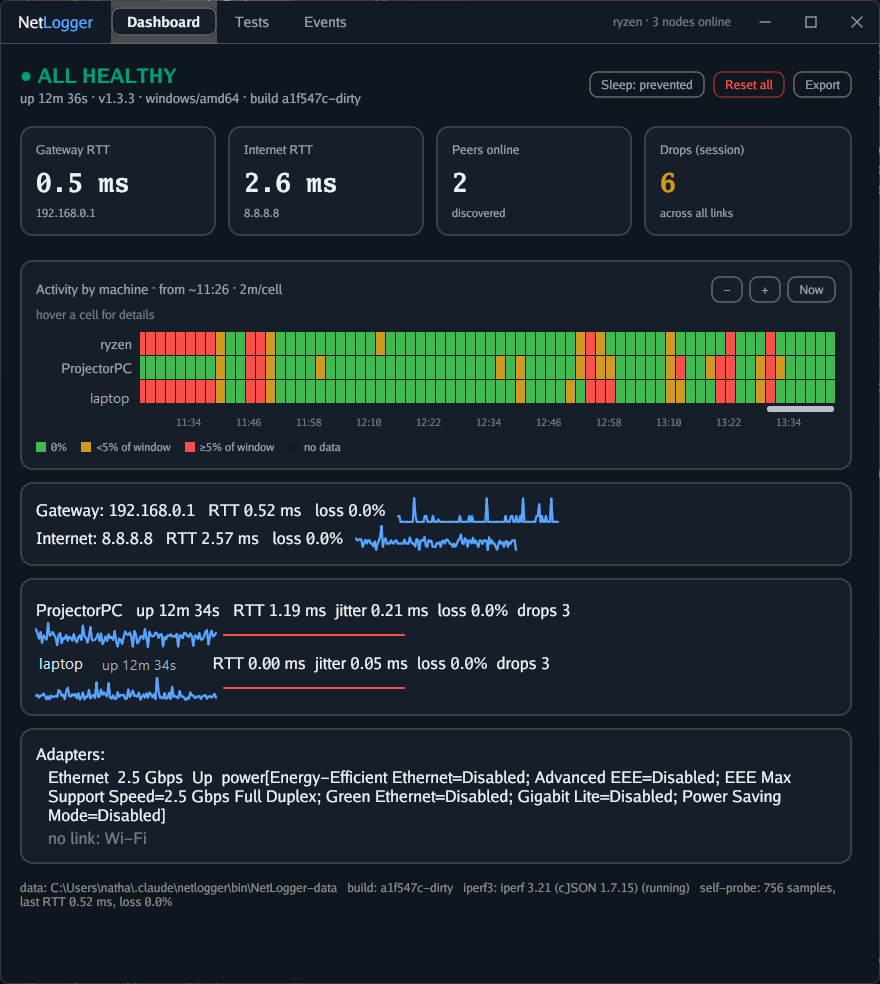
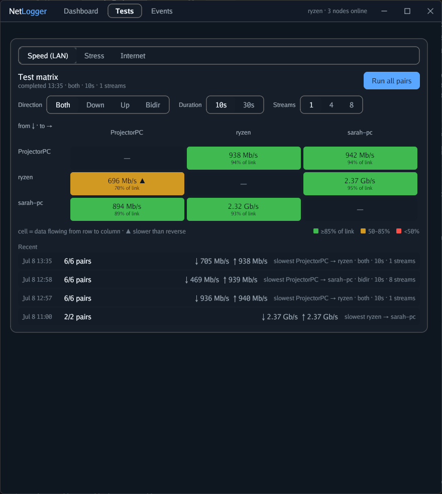
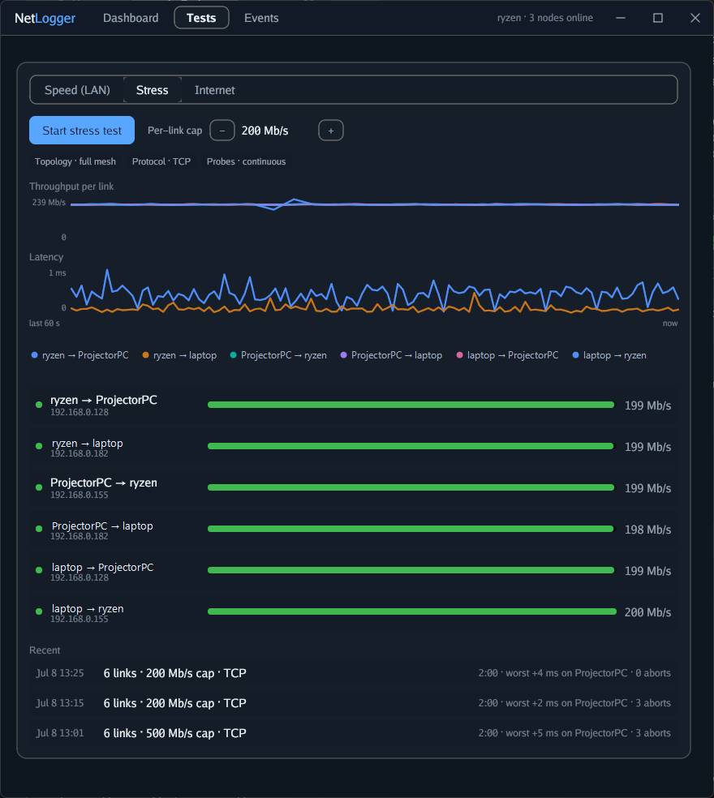
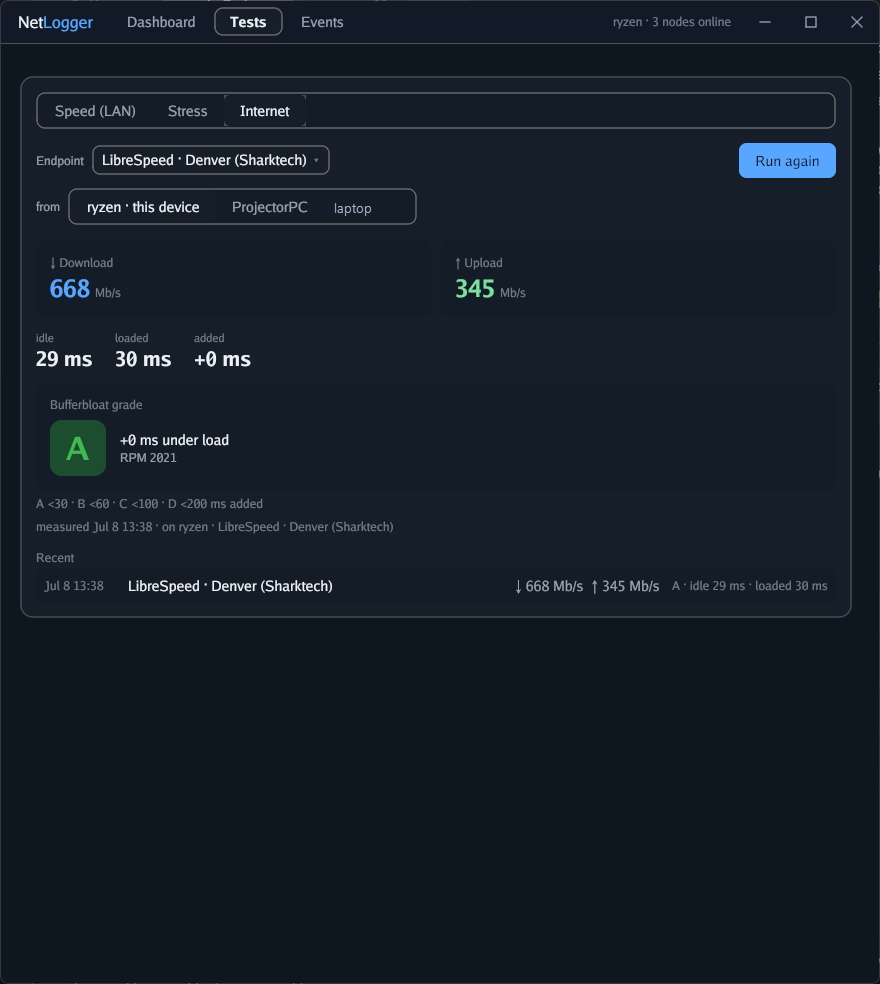

# NetLogger

**A portable, zero-config tool for catching network problems that come and go.**

Put the same app on every machine on your network (Windows `.exe`, macOS `.app`). The copies find each other, watch every connection around the clock, and line their timelines up side by side — so when your stream stutters at 2 AM, you can see **which machine's connection** blinked, **when**, and **whether it only happens under load**.

NetLogger was built to catch a real ghost: a PC whose wired connection silently reset only while streaming, on a network where every speed test said "all healthy." One-shot tests can't catch problems that come and go. NetLogger watches everything, all the time.

  



---

## Features

### Always-on monitoring

- Every machine continuously probes every other machine — plus your router and the internet — with regular pings and a rapid stream of tiny UDP packets, the traffic that actually breaks video calls and game streams.
- The **heatmap** puts all machines on one timeline. Red across every row at once points at shared gear (switch, router); red on one row points at that machine's cable, port, or network card. Hover any cell for details.
- Watches each network adapter too: link speed, power-saving modes (a classic cause of silent dropouts), error counters, and physical unplug/replug events.
- One merged **event log** across every machine.

### LAN speed matrix



- Every connection measured in both directions with the built-in iperf3. A cell is the speed from its row to its column, graded as **% of what that link should do** — 940 Mb/s is great on a gigabit port and a problem on a 2.5-gig one.
- `▲` flags a link that's much slower in one direction than the other — usually a bad end.
- Cells update **every second** while a test runs; click any cell for the per-second chart and detail.
- Pick direction, duration, and parallel streams; history remembers the settings behind every result.

### Full-mesh stress test



- Every machine loads every other machine **at once**, at a rate cap you choose, *while the monitoring keeps measuring*. If your problem only shows up under load, this reproduces it on demand — and the heatmap catches it.
- Throughput and latency share one time axis: a speed dip and a lag spike on the same second is the fault, caught in the act.
- Safety rails: rate cap, time limit, automatic stop for failing links, and a Stop button that halts every machine instantly. Every run saves a summary — including the worst lag added on each machine.

### Internet speed + bufferbloat



- Speed test against public LibreSpeed servers, runnable from **any machine in the mesh** to compare their internet paths.
- Measures latency *while the line is full* and grades the increase **A–F**. That's bufferbloat — the reason games and calls lag even when a speed test says everything's fine.

### Made to leave running

- Native app, one small binary. No installer, no browser, no background services.
- On Windows it closes to the tray and keeps watching. One-click JSON export of everything for sharing or analysis.
- All data stays on your machines. The only outside traffic is the internet speed test itself.

---

## Quick start

1. Build the app (below) and put the **same build** on two or more machines on the same network.
2. Run it. Windows asks for administrator once per launch; macOS just asks to allow local network access.
3. That's it — no setup. The machines find each other within seconds and the dashboard starts filling in. Leave it running; the longer it watches, the more it can tell you.
4. When something misbehaves, check the heatmap for red. To provoke a load-triggered fault on purpose, run the stress test and watch.

**Requirements:** Windows 10/11 or macOS 11+, machines on the same local network.

**Ports** (Windows firewall rules are added automatically):

| Port | Protocol | Purpose |
|---|---|---|
| 8088 | TCP | Node-to-node coordination |
| 8089 | UDP | Probe echo |
| 5201+ | TCP | iperf3 speed/stress servers |
| 48076 | UDP | Auto-discovery (multicast) |

---

## Building from source

### Windows

Go 1.26+, nothing else. For the icon and manifest, install [goversioninfo](https://github.com/josephspurrier/goversioninfo) once:

```powershell
go install github.com/josephspurrier/goversioninfo/cmd/goversioninfo@latest
./scripts/build-app.ps1     # → bin/NetLogger.exe
```

Tests: `go test ./...`

### macOS

Must be built on a Mac (the UI toolkit links Apple frameworks). Developer guide: [docs/MACOS.md](docs/MACOS.md).

```bash
./scripts/bootstrap-mac.sh  # once: Xcode CLT, Go, iperf3
./scripts/build-mac.sh      # → bin/NetLogger.app
```

macOS notes: no admin ever; speed/stress tests need `brew install iperf3`; data lives in `~/Library/Application Support/NetLogger`; unsigned app → right-click → Open, once.

---

## FAQ

**Why does it need administrator on Windows?**
Pings need raw network access, and the app adds its own firewall rules so machines can reach each other. macOS needs neither.

**My machines don't see each other.**
They must be on the same network segment. Usual suspects: different VLANs or subnets, guest Wi-Fi with device isolation, a firewall blocking `48076/udp`, or one machine on an older version (the header warns you).

**What does "% of link" mean?**
Speed graded against the slower end's port speed — the only fair yardstick when your network mixes 1-gig and 2.5-gig gear. On Wi-Fi the yardstick is the current radio rate, which runs optimistic.

**Why do my numbers differ from Ookla / fast.com?**
Those test your internet. The matrix tests your **LAN** — machine to machine, traffic that never leaves the building. The internet test itself varies ±10% run to run; that's normal. Watch patterns, not single runs.

**What's a good bufferbloat grade?**
It's how much lag appears when your line is full: A is under 30 ms added, F is over 200. You can ace a speed test and still fail this — that's the "internet feels slow but the speed test looks fine" disease.

**Is the stress test safe?**
It saturates your LAN on purpose, so expect things to feel sluggish *during* the run. It's rate-capped, time-limited, stops failing links automatically, and the Stop button halts every machine at once. It never touches your internet connection.

**Where does my data go?**
Nowhere. Each machine keeps its own local database. The only outside traffic is the internet speed test (to a server you can see and pin) and a reachability ping to 8.8.8.8.

**How do I quit on Windows?**
The X hides it to the tray so monitoring continues. Right-click the tray icon → Quit.

**How many machines can join?**
No hard limit; the grid stays readable up to a handful — which fits the home and small-lab problems it's built for.

**"iperf3 not found" on my Mac?**
`brew install iperf3`. Windows builds have it bundled.

**The header says "version mismatch."**
Update every machine to the same version. A Mac and a PC on the same version work together fine.

---

## Under the hood

| Package | Role |
|---|---|
| `internal/appcore` | The engine: probes, peer sync, test orchestration, events, export |
| `internal/ui` | The dashboard ([Gio](https://gioui.org), pure Go) |
| `internal/probe` | Ping + UDP probing and the echo responder |
| `internal/discovery` | Automatic peer discovery (UDP multicast) |
| `internal/iperf` | Bundled iperf3: live stream parsing, all test modes, cancellation |
| `internal/store` | Local SQLite storage |

Each node serves a small LAN-only API — that's how any machine can run tests on any other and show the whole mesh in one window. Design docs live under [docs/](docs/).

## Honest limitations

- The cross-machine timeline assumes clocks are roughly in sync (normal NTP is plenty).
- The internet test doesn't measure jitter/loss yet; the bufferbloat delta is the meaningful number.
- It reports; you conclude. NetLogger points at a machine, link, and moment — it won't tell you to buy a new cable (though it has found one).

---

## Credits

NetLogger stands on excellent prior work:

- **[Gio UI](https://gioui.org)** — Elias Naur and contributors. The pure-Go GUI toolkit behind the single-binary dashboard.
- **[iperf3](https://software.es.net/iperf/)** — ESnet / Lawrence Berkeley National Laboratory (BSD-3). The canonical network load generator, bundled for the speed and stress tests, with **cygwin1.dll** from the [Cygwin](https://www.cygwin.com/) project (LGPL) on Windows.
- **[LibreSpeed](https://librespeed.org)** and its server sponsors — notably **Clouvider** and **Sharktech** — whose open endpoints power the internet test. Be kind to their donated bandwidth.
- **[Bufferbloat.net](https://www.bufferbloat.net)** — Dave Täht, Toke Høiland-Jørgensen, and community. Their [RRUL](https://www.bufferbloat.net/projects/bloat/wiki/RRUL_Spec/) method (saturate while measuring latency, as in [Flent](https://flent.org)) is the basis of the stress test; Apple's responsiveness work inspired the RPM metric.
- **Go dependencies:** [modernc.org/sqlite](https://gitlab.com/cznic/sqlite) (Jan Mercl), [pro-bing](https://github.com/prometheus-community/pro-bing), [jackpal/gateway](https://github.com/jackpal/gateway), [google/uuid](https://github.com/google/uuid), [gopkg.in/yaml.v3](https://github.com/go-yaml/yaml), golang.org/x, and [goversioninfo](https://github.com/josephspurrier/goversioninfo) (Joseph Spurrier).
- Built with **[Claude Code](https://claude.com/claude-code)** (Anthropic).

## License

[MIT](LICENSE). Bundled binaries keep their own licenses: iperf3 (BSD-3), cygwin1.dll (LGPL).
